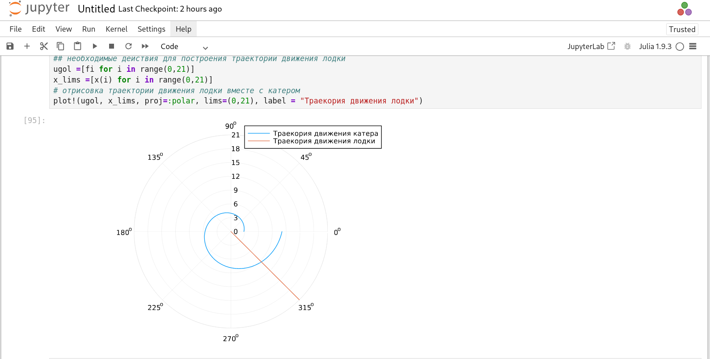
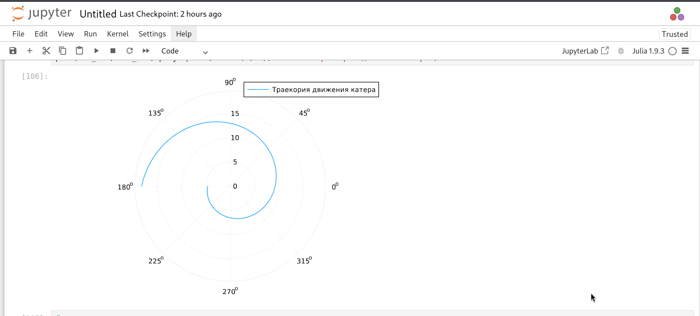

---
## Front matter
title: "Лабораторная работа №2"
subtitle: "Задача о погоне"
author: "НВЕ МАНГЕ ХОСЕ ХЕРСОН МИКО.  НКНбд-01-22."

## Generic otions
lang: ru-RU
toc-title: "Содержание"

## Bibliography
bibliography: bib/cite.bib
csl: pandoc/csl/gost-r-7-0-5-2008-numeric.csl

## Pdf output format
toc: true # Table of contents
toc-depth: 2
lof: true # List of figures
lot: false # List of tables
fontsize: 12pt
linestretch: 1.5
papersize: a4
documentclass: scrreprt
## I18n polyglossia
polyglossia-lang:
  name: russian
  options:
	- spelling=modern
	- babelshorthands=true
polyglossia-otherlangs:
  name: english
## I18n babel
babel-lang: russian
babel-otherlangs: english
## Fonts
mainfont: PT Serif
romanfont: PT Serif
sansfont: PT Sans
monofont: PT Mono
mainfontoptions: Ligatures=TeX
romanfontoptions: Ligatures=TeX
sansfontoptions: Ligatures=TeX,Scale=MatchLowercase
monofontoptions: Scale=MatchLowercase,Scale=0.9
## Biblatex
biblatex: true
biblio-style: "gost-numeric"
biblatexoptions:
  - parentracker=true
  - backend=biber
  - hyperref=auto
  - language=auto
  - autolang=other*
  - citestyle=gost-numeric
## Pandoc-crossref LaTeX customization
figureTitle: "Рис."
tableTitle: "Таблица"
listingTitle: "Листинг"
lofTitle: "Список иллюстраций"
lotTitle: "Список таблиц"
lolTitle: "Листинги"
## Misc options
indent: true
header-includes:
  - \usepackage{indentfirst}
  - \usepackage{float} # keep figures where there are in the text
  - \floatplacement{figure}{H} # keep figures where there are in the text
---

# Цель работы

Построить математическую модель для выбора правильной стратегии при решении примера задаче о погоне.

# Задание

На море в тумане катер береговой охраны преследует лодку браконьеров.
Через определенный промежуток времени туман рассеивается, и лодка обнаруживается на расстоянии 14,4 км от катера. Затем лодка снова скрывается в тумане и уходит прямолинейно в неизвестном направлении. Известно, что скорость катера в 4,7 раза больше скорости браконьерской лодки.

1. Записать уравнение, описывающее движение катера, с начальными условиями для двух случаев (в зависимости от расположения катера относительно лодки в начальный момент времени).

2. Построить траекторию движения катера и лодки для двух случаев.

3. Найти точку пересечения траектории катера и лодки 

# Теоретическое введение

Кривая погони — кривая, представляющая собой решение задачи о «погоне», которая ставится следующим образом. Пусть точка A равномерно движется по некоторой заданной кривой. Требуется найти траекторию равномерного движения точки P такую, что касательная, проведённая к траектории в любой момент движения, проходила бы через соответствующее этому моменту положение точки A [@wiki:bash].

# Выполнение лабораторной работы

Формула для выбора варианта: `(1032225355%70)+1` = 36 вариант.

Запишем уравнение описывающее движение катера, с начальными условиями для двух случаев (в зависимости от расположения катера относительно лодки в начальный момент времени).

Принимем за $t_0 = 0$, $x_0 = 0$ -- место нахождения лодки браконьеров в момент обнаружения,$x_{k0} = k$ - место нахождения катера береговой охраны относительно лодки браконьеров в момент обнаружения лодки.

Введем полярные координаты. Считаем, что полюс - это точка обнаружения лодки браконьеров $x_{k0}$ ($\theta = x_{k0} = 0$), а полярная ось $r$ проходит через точку нахождения катера береговой охраны.

Траектория катера должна быть такой, чтобы и катер, и лодка все время были на одном расстоянии от полюса $\theta$ , только в этом случае траектория
катера пересечется с траекторией лодки. Поэтому для начала катер береговой охраны должен двигаться некоторое время прямолинейно, пока не окажется на том же расстоянии от полюса, что и лодка браконьеров. После этого катер береговой охраны должен двигаться вокруг полюса удаляясь от него с той же скоростью, что и лодка браконьеров.

Чтобы найти расстояние $x$ (расстояние после которого катер начнет двигаться вокруг полюса), необходимо составить простое уравнение. Пусть через время $t$ катер и лодка окажутся на одном расстоянииx от полюса. За это время лодка пройдет $x$ , а катер $k-x$ (или $k+x$, в зависимости от начального положения катера относительно полюса). Время, за которое они пройдут это расстояние, вычисляется как $\dfrac{x}{v}$ или $\dfrac{k-x}{4.7v}$ (во втором случае $\dfrac{k+x}{4.7v}$). Так как время одно и то же, то эти величины одинаковы. Тогда неизвестное расстояниеx можно найти из следующего уравнения:

$$
\dfrac{x}{v} = \dfrac{k-x}{4.7v} \text{ -- в первом случае}
$$
$$
\dfrac{x}{v} = \dfrac{k+x}{4.7v} \text{ -- во втором}
$$

Отсюда мы найдем два значения $x_1 = \dfrac{14.4}{5,1}$ и $x_2 = \dfrac{14.4}{3,1}$, задачу будем решать для двух случаев.

После того, как катер береговой охраны окажется на одном расстоянии от полюса, что и лодка, он должен сменить прямолинейную траекторию и начать двигаться вокруг полюса удаляясь от него со скоростью лодки $v$. Для этого скорость катера раскладываем на две составляющие: $v_{r}$ - радиальная скорость и  - $v_{\tau}$ тангенциальная скорость. Радиальная скорость - это скорость, с которой катер удаляется от полюса, $v_r = \dfrac{dr}{dt}$. Нам нужно, чтобы эта скорость была равна скорости лодки, поэтому полагаем $\dfrac{dr}{dt} = v$.

Тангенциальная скорость – это линейная скорость вращения катера относительно полюса. Она равна произведению угловой скорости $\dfrac{d \theta}{dt}$ на радиус $r$, $r \dfrac{d \theta}{dt}$.

Получаем: 

$$v_{\tau} = \sqrt{22.09v^2-v^2} = \sqrt{21.09}v$$

Из чего можно вывести:

$$
r\dfrac{d \theta}{dt} = \sqrt{21.09}v
$$

Решение исходной задачи сводится к решению системы из двух дифференциальных уравнений:

$$\begin{cases}
&\dfrac{dr}{dt} = v\\
&r\dfrac{d \theta}{dt} = \sqrt{21.09}v
\end{cases}$$

С начальными условиями для первого случая:

$$\begin{cases}
&{\theta}_0 = 0\\  \tag{1}
&r_0 = \dfrac{14.4}{5.1}
\end{cases}$$

Или для второго:

$$\begin{cases}
&{\theta}_0 = -\pi\\  \tag{2}
&r_0 = \dfrac{14.4}{3.1}
\end{cases}$$

Исключая из полученной системы производную по $t$, можно перейти к следующему уравнению:

$$
\dfrac{dr}{d \theta} = \dfrac{r}{\sqrt{21.09}}
$$

Начальные условия остаются прежними. Решив это уравнение, мы получим траекторию движения катера в полярных координатах.

## Построение модели

```Julia
using DifferentialEquations, Plots

# расстояние от лодки до катера

k = 14.4 

# начальные условия для 1 и 2 случаев

r0 = k/5.1 
r0_2 = k/3.1 
theta0 = (0.0, 2*pi) 
theta0_2 = (-pi, pi)

# данные для движения лодки браконьеров

fi = 3*pi/4;
t = (0, 50);

# функция, описывающая движение лодки браконьеров

x(t) = tan(fi)*t;

# функция, описывающая движение катера береговой охраны

f(r, p, t) = r/sqrt(21.09)

# постановка проблемы и решение ДУ для 1 случая

prob = ODEProblem(f, r0, theta0)

sol = solve(prob, saveat = 0.01)

# отрисовка траектории движения катера

plot(sol.t, sol.u, proj=:polar, lims=(0, 21), label = "Траекория движения катера")
```

В результате получаем такой рисунок (рис. [-@fig:001]):

{#fig:001 width=70%}

```Julia

## необходимые действия для построения траектории движения лодки

ugol = [fi for i in range(0,21)]

x_lims = [x(i) for i in range(0,21)]

# отрисовка траектории движения лодки вместе с катером

plot!(ugol, x_lims, proj=:polar, lims=(0, 21), label = "Траекория движения лодки")
```

В результате получаем такой рисунок (рис. [-@fig:002]):

{#fig:002 width=70%}


```Julia

# точное решение ДУ, описывающего движение катера береговой охраны

y(x)=(1440*exp(10*x)/(sqrt(2109)))/(509)

# подставим в точное решение угол, под которым движется лодка браконьеров для нахождения точки пересечения

y(fi)

# точка пересечения лодки и катера для 1 случая

13.628170843477646e8
```

Теперь перейдем к решению в случае 2.

```Julia

# постановка проблемы и решение ДУ для 2 случая

prob_2 = ODEProblem(f, r0_2, theta0_2)

sol_2 = solve(prob_2, saveat = 0.01)

# отрисовка траектории движения катера

plot(sol_2.t, sol_2.u, proj=:polar, lims=(0,21), label = "Траекория движения катера")
```

В результате получаем такой рисунок (рис. [-@fig:003]):

{#fig:003 width=70%}


```Julia

# отрисовка траектории движения лодки вместе с катером

plot!(ugol, x_lims, proj=:polar, lims=(0, 21), label = "Траекория движения лодки")
```

В результате получаем такой рисунок (рис. [-@fig:004]):

{#fig:004 width=70%}

```Julia

# точное решение ДУ, описывающего движение катера береговой охраны для 2 случая

y2(x)=(144*exp((10*x/sqrt(2109))+(10*pi/sqrt(2109))))/(31)

# подставим в точное решение угол, под которым движется лодка браконьеров для нахождения точки пересечения

y2(fi-pi)

# точка пересечения лодки и катера для 2 случая

11.651143558300665
```

# Выводы

В процессе выполнения данной лабораторной работы я построила математическую модель для выбора правильной стратегии при решении примера задаче о погоне.

# Список литературы{.unnumbered}

::: {#refs}
:::
