---
## Front matter
lang: ru-RU
title: Лабораторная работа 14
subtitle: Модели обработки заказов
author:
  - НВЕ МАНГЕ ХОСЕ ХЕРСОН МИКО.
institute:
  - Российский университет дружбы народов, Москва, Россия

## i18n babel
babel-lang: russian
babel-otherlangs: english

## Formatting pdf
toc: false
toc-title: Содержание
slide_level: 2
aspectratio: 169
section-titles: true
theme: metropolis
header-includes:
 - \metroset{progressbar=frametitle,sectionpage=progressbar,numbering=fraction}
 - '\makeatletter'

 - '\makeatother'
---

# Информация

## Докладчик

:::::::::::::: {.columns align=center}
::: {.column width="60%"}

  * НВЕ МАНГЕ ХОСЕ ХЕРСОН МИКО
  * студент
  * Российский университет дружбы народов
  * [1032225355@pfur.ru](mailto:1032225355@pfur.ru)
  * <https://nvemangue.github.io/ru/>

:::
::: {.column width="25%"}

:::
::::::::::::::

## Цель работы

Реализовать модели обработки заказов и провести анализ результатов.

## Задание

Реализовать с помощью gpss:

- модель оформления заказов клиентов одним оператором;
- построение гистограммы распределения заявок в очереди;
- модель обслуживания двух типов заказов от клиентов в интернет-магазине;
- модель оформления заказов несколькими операторами.

# Выполнение лабораторной работы

## Модель оформления заказов клиентов одним оператором

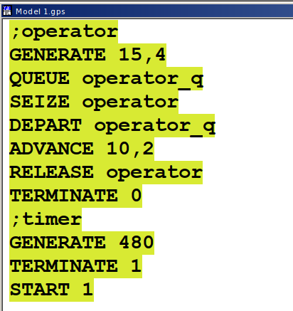{#fig:001 width=40%}

## Модель оформления заказов клиентов одним оператором

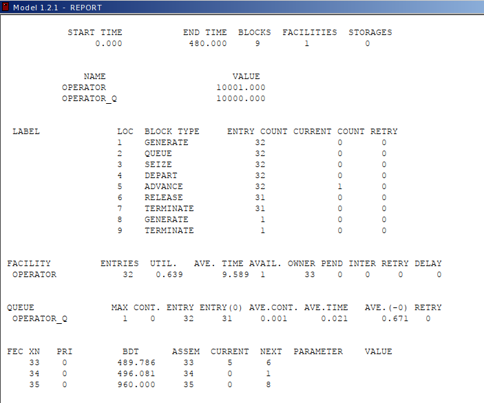{#fig:002 width=50%}

## Упражнение

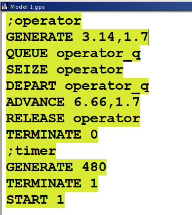{#fig:003 width=40%}

## Упражнение

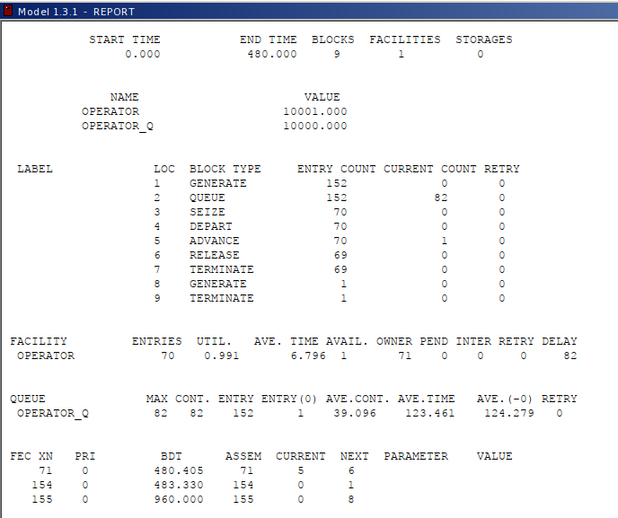{#fig:004 width=50%}

## Построение гистограммы распределения заявок в очереди

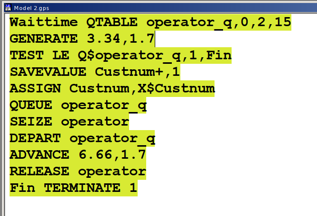{#fig:005 width=50%}

## Построение гистограммы распределения заявок в очереди

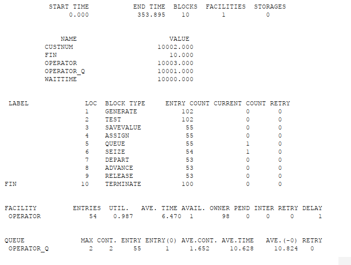{#fig:006 width=50%}

## Построение гистограммы распределения заявок в очереди

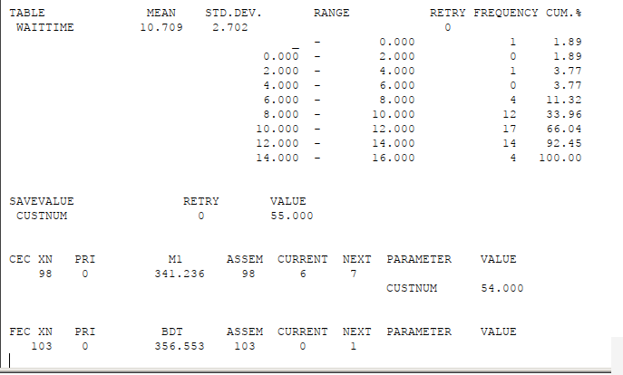{#fig:007 width=70%}

## Построение гистограммы распределения заявок в очереди

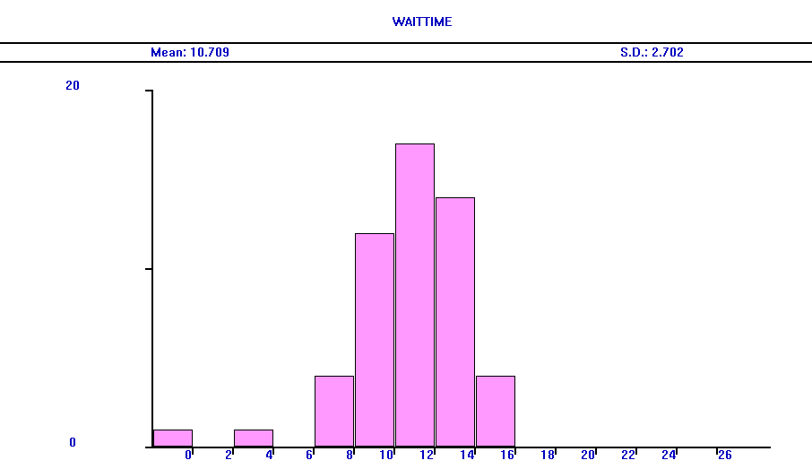{#fig:008 width=70%}

## Модель обслуживания двух типов заказов от клиентов в интернет-магазине

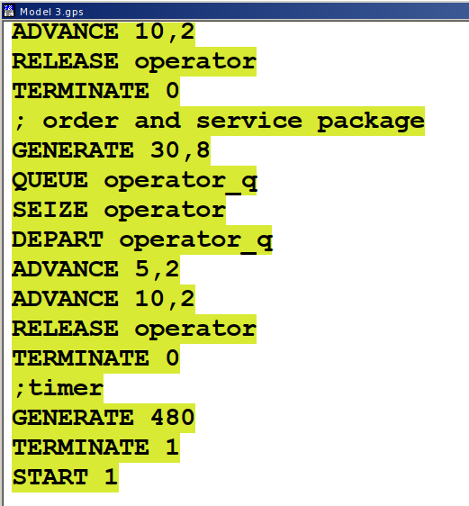{#fig:009 width=40%}

## Модель обслуживания двух типов заказов от клиентов в интернет-магазине

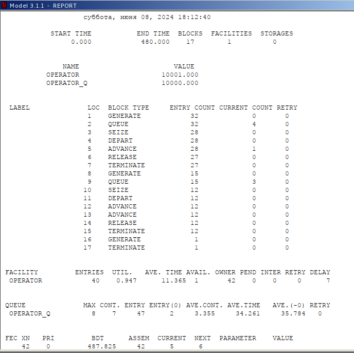{#fig:010 width=50%}

## Упражнение

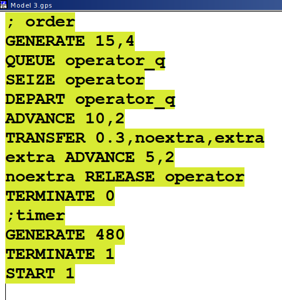{#fig:011 width=40%}

## Упражнение

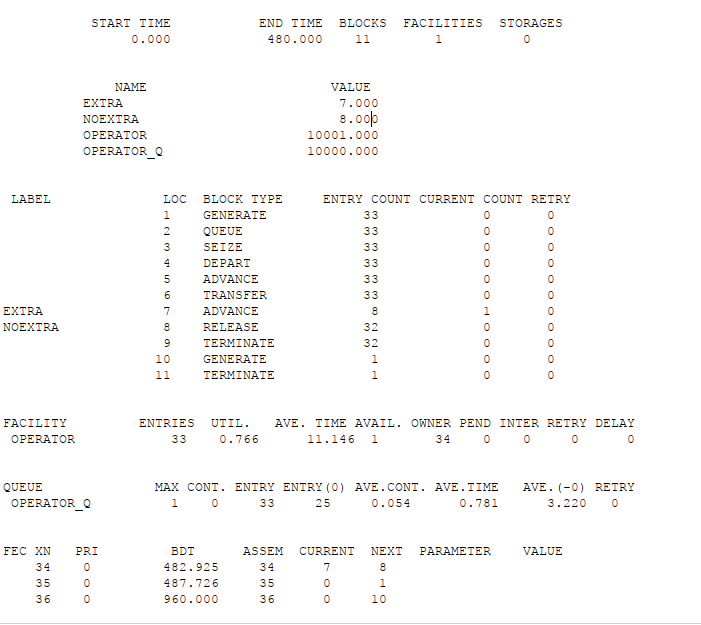{#fig:012 width=50%}

## Модель оформления заказов несколькими операторами

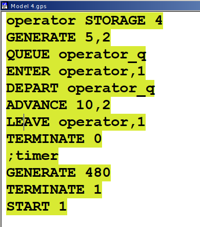{#fig:013 width=40%}

## Модель оформления заказов несколькими операторами

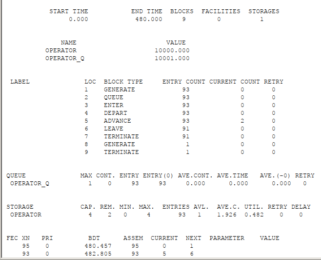{#fig:014 width=50%}

## Упражнение

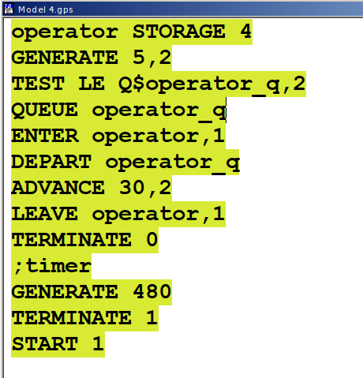{#fig:015 width=40%}

## Упражнение

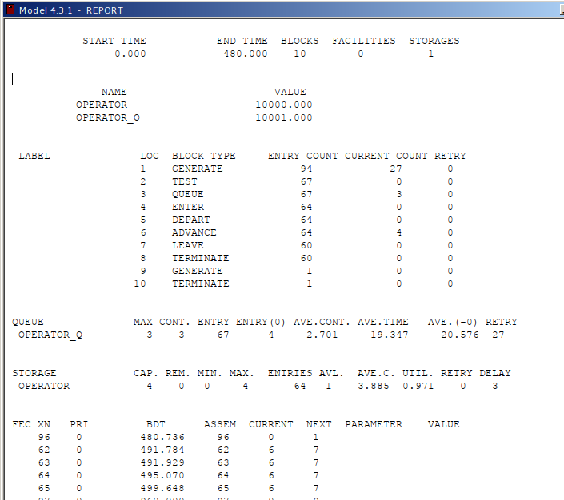{#fig:016 width=50%}

## Выводы

В результате была реализована с помощью gpss:

- модель оформления заказов клиентов одним оператором;
- построение гистограммы распределения заявок в очереди;
- модель обслуживания двух типов заказов от клиентов в интернет-магазине;
- модель оформления заказов несколькими операторами.

## Книги и учебные пособия

    Королькова А. В., Кулябов Д. С.
    Моделирование информационных процессов. — М.: РУДН, 2015.

        О чем: Лабораторные работы по GPSS, примеры моделирования очередей в интернет-магазинах.

        ISBN: 978-5-209-06234-1.

    Советов Б. Я., Яковлев С. А.
    Моделирование систем. — М.: Высшая школа, 2018.

        О чем: Основы имитационного моделирования, включая GPSS и другие инструменты.

        ISBN: 978-5-06-006222-8.

    Томашевский В. Н., Жданова Е. Г.
    Имитационное моделирование в среде GPSS. — СПб.: БХВ-Петербург, 2010.

        О чем: Практическое руководство по GPSS с примерами задач.

        ISBN: 978-5-9775-0414-5.

    Клейнрок Л.
    Теория массового обслуживания. — М.: Машиностроение, 1979.

        О чем: Классическая теория очередей (перевод книги Queueing Theory).
        
## Научные статьи и публикации

    Кулябов Д. С., Королькова А. В.
    Моделирование обработки заказов в интернет-магазине с использованием 
    GPSS // Труды РУДН. Серия "Информатизация образования". — 2020. — № 3. — С. 137–143.
    

    Петухов А. П.
    Анализ многоканальных систем обслуживания на основе 
    GPSS // Автоматика и телемеханика. — 2017. — № 5. — С. 45–52.
    
## Ключевые слова для поиска

    "Моделирование обработки заказов GPSS"

    "Системы массового обслуживания в логистике"

    "Примеры моделей FIFO в GPSS"
